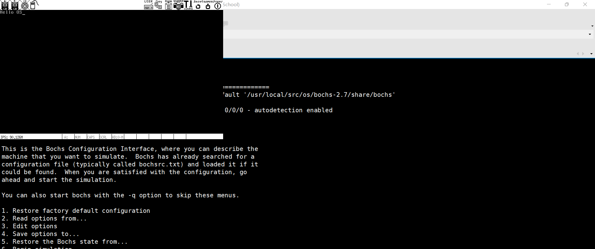

## 什么是引导程序
当计算机加电后，CPU的CS:IP寄存器被强制初始化为, 这是为了让CPU先执行BIOS程序，该程序检测并初始化硬件（通过硬件自己提供的初始化功能调用）。在这个过程中，CPU确实处于实模式（Real Mode），这是一种兼容早期8086处理器的运行模式。在实模式下，CPU能直接访问的内存空间是1MB，地址空间从0x00000到0xFFFFF。 这个1MB的内存空间被划分为多个区域 ，具体如下：

BIOS ROM: 通常位于地址空间的高端()，共64KB，包括基本输入输出系统（BIOS）代码。BIOS是存储在主板上的固件，负责初始化硬件并提供操作系统与硬件之间的通信接口。
RAM: 实际的随机存取存储器（RAM）占据了大部分的1MB地址空间。
其他固定映射硬件: 有些特定的内存区域可能被映射到其他硬件设备。

## bochs 启动流程
```
./bochs -f start
```
1. **初始化硬件**
   在启动过程中，Bochs 会模拟计算机的硬件，包括：
   - 初始化 CPU 和内存。
   - 模拟 BIOS 和其他硬件组件。

2. **加载 BIOS**
   Bochs 将 BIOS 加载到内存中。BIOS 是一种固件，它负责硬件初始化和启动过程。通常，它会被加载到内存的固定地址。

3. **执行 BIOS 启动过程**
   - BIOS 会执行自检（POST），检查硬件的状态。
   - BIOS 将搜索可引导设备（例如虚拟硬盘、光盘等）以找到引导扇区。

4. **加载引导扇区**
   BIOS 找到第一个可引导设备后，它会读取该设备的第一个扇区（通常是 512 字节），将其加载到内存地址 `0x7C00`。
   - 这个扇区通常包含引导程序。

5. **跳转到引导程序**
   一旦引导程序被加载到 `0x7C00` 地址，BIOS 会跳转到该地址开始执行引导程序。

6. **进入操作系统**
   引导程序完成初始化后，会将控制权转交给操作系统内核，开始操作系统的运行。


+ 启动 Bochs，读取配置文件。
+ 初始化硬件和加载 BIOS。
+ 执行 BIOS，查找引导设备。
+ 加载引导扇区到内存。
+ 跳转到引导程序并执行。
+ 引导程序初始化操作系统，控制权交给内核。


## 程序-引导程序实现
编写启动类 汇编代码
```
; boot.asm
[org 0x7C00]          ; 指定引导程序加载地址

section .text
    ; 设置文本模式
    mov ax, 0x0003    ; 设置 80x25 文本模式
    int 0x10          ; BIOS 中断调用

    ; 输出字符串 "Hello OS"
    mov si, hello_msg  ; 将字符串地址加载到 SI 寄存器
    call print_string   ; 调用字符串输出函数

    ; 无限循环
    jmp $

; 字符串输出函数
print_string:
    mov ah, 0x0E      ; BIOS 角色输出服务
.next_char:
    lodsb             ; 加载下一个字符到 AL
    cmp al, 0         ; 检查是否到达字符串结尾
    je .done
    int 0x10         ; 调用 BIOS 输出字符
    jmp .next_char
.done:
    ret

hello_msg db 'Hello OS', 0  ; 定义字符串，以 NULL 结尾

times 510 - ($ - $$) db 0    ; 填充到 510 字节
dw 0xAA55                     ; 引导扇区签名

```

```
dd if=boot.bin of=disk.img bs=512 count=1 conv=notrunc
```
编译运行 bochs加载bios后，进入引导程序



